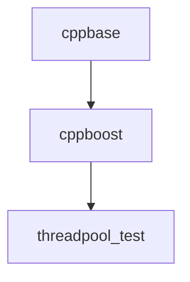

# docker_threadpool_cpp
Docker test - Modern C++ thread pool

# This test requires creating two Docker images to build
# 1)  cppbase (see subdirectory)
# 2)  cppboost (see subdirectory)

#  Build cppbase first, then cppboost.
#  Then build the Dockerfile in this directory
#  cd cppbase && docker build . -t cppbase:1.0.0
#  cd cppboost && docker build . -t cppboost:1.0.0
#  docker build . -t threadpool_test:1.0.0

